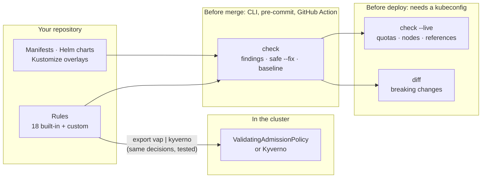

# 🛡️ k8s-guardian

> **Kubernetes guardrails that know your cluster**: check and safely fix manifests, Helm charts and Kustomize overlays, see whether they fit the target cluster, and enforce the same rules at admission time. A CLI, a `kubectl` plugin, a GitHub Action and an MCP server in one binary.

[](https://github.com/andronaft/k8s-guardian/actions/workflows/ci.yml)
[](https://github.com/andronaft/k8s-guardian/releases)
[](https://goreportcard.com/report/github.com/andronaft/k8s-guardian)
[](https://github.com/andronaft/k8s-guardian/pkgs/container/k8s-guardian)
[](LICENSE)


Most Kubernetes linters read a YAML file and print an error. `k8s-guardian` also answers the questions you hit **at deploy time**:

* *"The YAML is valid, but will it actually run in `prod`?"* Quotas, node sizes, LimitRanges, missing Secrets, CRDs.
* *"What breaks if I apply this over what's running now?"* Immutable selectors, removed APIs, downtime, port changes.
* *"Can you just fix it, without breaking my app?"* Safe fixes by default, riskier ones only when you ask.
* *"Can the cluster enforce exactly what CI checks?"* Export the same rules as ValidatingAdmissionPolicies or Kyverno policies.



## Features

| Feature | Command | Docs |
|---|---|---|
| **18 built-in rules**: requests/limits, non-root, privilege escalation, capabilities, probes, `:latest`, host namespaces, seccomp, Service wiring, removed APIs, RBAC wildcards | `check -f` | [check](docs/check.md) |
| **Safe auto-fix** that keeps comments and leaves unchanged YAML byte for byte; riskier fixes opt-in | `check --fix [--unsafe-fixes]` | [check](docs/check.md#fixes) |
| **Helm, Kustomize, Argo Rollouts**: render charts with your own `--values` | `check -f chart --values prod.yaml` | [check](docs/check.md#inputs) |
| **Config file and baseline**: adopt it in an existing repo and fail only on new findings | `.k8s-guardian.yaml`, `--baseline` | [configuration](docs/configuration.md) |
| **Live cluster context**: ResourceQuota headroom, node capacity, LimitRanges, missing ConfigMaps/Secrets, CRDs | `check --live` | [live](docs/live.md) |
| **Breaking-change detector** against what is deployed | `diff -f` | [diff](docs/diff.md) |
| **Enforce in the cluster** with the same decisions as the CLI (tested against a real API server and Kyverno) | `export vap\|kyverno` | [enforce](docs/enforce.md) |
| **Custom rules** in a small YAML format, no Rego | `--rules`, `.k8s-guardian/rules/` | [custom rules](docs/custom-rules.md) |
| **CI**: GitHub Action with PR annotations, SARIF, pre-commit, Docker | `uses: andronaft/k8s-guardian@v0.5.0` | [CI](docs/ci.md) |
| **kubectl plugin** and **MCP server** for Claude Code / Cursor | `kubectl guard`, `mcp` | [MCP](docs/mcp.md) |
| **AI fixes** for what rules can't fix (optional, needs an API key) | `check --fix --ai` | [AI](docs/ai.md) |

**Experimental:** [cost estimation and right-sizing](docs/cost.md) (`cost`), the [interactive review TUI](docs/interactive.md) (`interactive`) and [rules from plain language](docs/ai.md#policies-from-plain-language-experimental) (`rule create`). They work and are tested, but their output and flags may change.

## Install

```bash
# Go (>= 1.26)
go install github.com/andronaft/k8s-guardian/cmd/k8s-guardian@latest

# Docker (multi-arch)
docker run --rm -v "$PWD:/work" ghcr.io/andronaft/k8s-guardian check -f .

# Krew: installs the plugin as `kubectl guard-workloads`
kubectl krew install --manifest-url=https://raw.githubusercontent.com/andronaft/k8s-guardian/main/docs/krew/guard-workloads.yaml

# From source (also creates the kubectl-guard plugin symlink)
git clone https://github.com/andronaft/k8s-guardian && cd k8s-guardian && make build && sudo make install
```

Binaries for Linux, macOS and Windows are on the [releases page](https://github.com/andronaft/k8s-guardian/releases).

## Quick start

```bash
k8s-guardian check -f k8s/                        # check files, directories, Helm charts, Kustomize
k8s-guardian check -f k8s/ --fix                  # apply the safe fixes in place
k8s-guardian check -f k8s/ --update-baseline      # existing repo? record today's findings...
k8s-guardian check -f k8s/ --baseline .k8s-guardian-baseline.json   # ...and fail only on new ones
k8s-guardian check -f k8s/ --live -n prod         # will it fit the cluster?
k8s-guardian diff -f k8s/ -n prod                 # what breaks if I apply it?
k8s-guardian export vap > guardrails.yaml         # enforce the same rules at admission
```

```text
examples/insecure-deployment.yaml  Deployment/web
  ✖ error   KG011  hostNetwork enabled (line 17)
  ⚠ warning KG013  securityContext.seccompProfile is not set to RuntimeDefault or Localhost [fixable] (line 17)
  ✖ error   KG001  container "nginx": missing resources.requests (cpu, memory) [unsafe fix] (line 19)
  ✖ error   KG004  container "nginx": securityContext.privileged is true (line 19)
  ✖ error   KG010  container "nginx": image "nginx:latest" uses the mutable :latest tag (line 19)
  ...
6 error(s), 4 warning(s), 2 info
1 issue(s) can be fixed automatically with --fix (add --ai to let Claude fix the rest)
4 more with --fix --unsafe-fixes: these can change how the workload runs (root images, writable filesystems, resources), so review them
```

In GitHub Actions:

```yaml
- uses: andronaft/k8s-guardian@v0.5.0
  with:
    path: k8s/
```

## Tested on real charts

k8s-guardian was run against 30 popular Helm charts (ingress-nginx, kube-prometheus-stack, Argo CD, cert-manager, Vault, Longhorn and more; 652 objects). The run found five bugs in k8s-guardian itself, including a `--fix` that broke privileged node agents, and all of them are fixed. See [docs/real-world-test.md](docs/real-world-test.md) for the results and a script to reproduce them.

## Documentation

* [Checking and fixing](docs/check.md): inputs, fixes, built-in rules, ignoring findings
* [Configuration](docs/configuration.md): `.k8s-guardian.yaml`, baseline, environment
* [Live cluster checks](docs/live.md) · [Breaking-change diff](docs/diff.md) · [Enforcing in the cluster](docs/enforce.md)
* [Custom rules](docs/custom-rules.md) · [CI integration](docs/ci.md) · [MCP server](docs/mcp.md) · [AI features](docs/ai.md)
* Experimental: [cost](docs/cost.md) · [interactive review](docs/interactive.md)

## Contributing

See [CONTRIBUTING.md](CONTRIBUTING.md) for development, the architecture and how to add a rule. Security issues: [SECURITY.md](SECURITY.md). Release notes are on the [releases page](https://github.com/andronaft/k8s-guardian/releases).

## License

[Apache 2.0](LICENSE)
