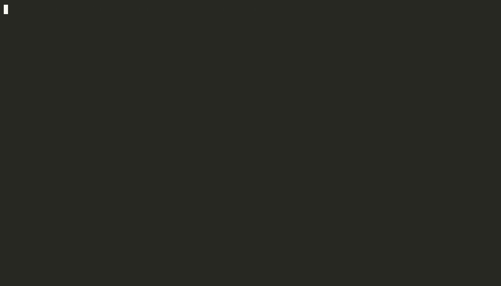

# 🛡️ k8s-guardian

> **AI-powered Kubernetes guardrails that know your cluster**: a CLI, a `kubectl` plugin and an MCP server in one binary.

[](https://github.com/andronaft/k8s-guardian/actions/workflows/ci.yml)
[](https://github.com/andronaft/k8s-guardian/releases)
[](https://goreportcard.com/report/github.com/andronaft/k8s-guardian)
[](https://github.com/andronaft/k8s-guardian/pkgs/container/k8s-guardian)
[](LICENSE)



Most Kubernetes linters are static: they read a YAML file and print an error. `k8s-guardian` also answers the questions you hit **at deploy time**:

* *"The YAML is valid, but will it actually run in `prod`?"* Quotas, node sizes, LimitRanges, missing Secrets, CRDs.
* *"What breaks if I apply this over what's running now?"* Immutable selectors, removed APIs, downtime, port changes.
* *"How much will this cost per month, and is 4 CPU really needed for a Go service?"*
* *"Can you just fix it?"* Deterministic fixes, Claude for the rest, and an interactive review TUI.
* *"How do I enforce our own policy without learning Rego?"* Describe it in plain language and get a rule.

## ✨ Features

| | Feature | Command |
|---|---|---|
| 🔍 | **17 built-in guardrails**: requests/limits, non-root, privilege escalation, capabilities, probes, `:latest`, host namespaces, seccomp, Service→Pod port wiring, removed APIs | `check -f` |
| 🔧 | **Deterministic auto-fix**: safe fixes by default, riskier ones opt-in; idempotent, and documents it doesn't change stay byte for byte | `check --fix [--unsafe-fixes]` |
| 🤖 | **AI auto-fix**: Claude fixes probes, image pinning and custom-rule violations, and leaves `TODO` comments instead of guessing | `check --fix --ai` |
| 🖥️ | **Interactive review TUI**: finding on the left, colored diff on the right, `[y]` accept `[n]` skip `[e]` edit | `interactive -f` |
| 🌐 | **Live cluster context**: ResourceQuota headroom, node capacity with nodeSelector, LimitRanges, missing ConfigMaps/Secrets/SAs/PVCs, CRDs, StorageClasses | `check --live` |
| 🔀 | **Breaking-change detector**: compares with what is deployed, flags immutable fields, selector drift, removed APIs for *your* cluster version, Recreate downtime, HPA conflicts | `diff -f` |
| 💰 | **Cost estimation + right-sizing**: $/month per workload (HPA-aware), real usage from metrics-server or 7-day p95/peak history from Prometheus, Claude recommendations with savings | `cost -f [--usage\|--prometheus URL] [--ai]` |
| 📜 | **Policies from plain language**: *"forbid :latest and require a contact email"* becomes a validated rule | `rule create "…"` |
| 🚦 | **Enforce in the cluster**: built-in and custom rules exported as native ValidatingAdmissionPolicies or Kyverno ClusterPolicies, with the same decisions as the CLI (tested against a real API server and the Kyverno CLI) | `export vap\|kyverno` |
| 🔌 | **kubectl plugin** | `kubectl guard …` |
| 🧠 | **MCP server** for Claude Code / Cursor: validate, fix, live-check, diff, cost, custom rules | `mcp` |
| ⚡ | **GitHub Action & CI**: inline PR annotations, job summary, SARIF, exit codes, pre-commit hooks | `uses: andronaft/k8s-guardian@v0.4.0` |

---

## 📦 Installation

```bash
# Go (>= 1.26)
go install github.com/andronaft/k8s-guardian/cmd/k8s-guardian@latest

# From source (also creates the kubectl-guard plugin symlink)
git clone https://github.com/andronaft/k8s-guardian && cd k8s-guardian
make build && sudo make install

# Docker (multi-arch, published to GHCR on every release)
docker run --rm -v "$PWD:/work" ghcr.io/andronaft/k8s-guardian check -f .

# Krew: installs the plugin as `kubectl guard-workloads` (the Krew name);
# from the manifest in this repo until it is listed in krew-index
kubectl krew install --manifest-url=https://raw.githubusercontent.com/andronaft/k8s-guardian/main/docs/krew/guard-workloads.yaml
```

## 🚀 Quick tour

### 1. Validate and fix

```bash
k8s-guardian check -f k8s/                      # files, directories, Helm charts, stdin (-f -)
k8s-guardian check -k overlays/prod             # Kustomize overlays (also: -f on a kustomization dir)
k8s-guardian check -f deploy.yaml --fix         # safe deterministic fixes, in place, comments kept
k8s-guardian check -f deploy.yaml --fix --unsafe-fixes  # + fixes that can change how the app runs
k8s-guardian check -f deploy.yaml --fix --ai    # + Claude for the rest (needs ANTHROPIC_API_KEY)
```

```text
examples/insecure-deployment.yaml  Deployment/web
  ✖ error   KG011  hostNetwork enabled (line 17)
  ⚠ warning KG013  securityContext.seccompProfile is not set to RuntimeDefault or Localhost [fixable] (line 17)
  ✖ error   KG001  container "nginx": missing resources.requests (cpu, memory) [unsafe fix] (line 19)
  ✖ error   KG003  container "nginx": securityContext.runAsNonRoot is not true [unsafe fix] (line 19)
  ✖ error   KG004  container "nginx": securityContext.privileged is true (line 19)
  ✖ error   KG010  container "nginx": image "nginx:latest" uses the mutable :latest tag (line 19)
  ...
6 error(s), 4 warning(s), 2 info
1 issue(s) can be fixed automatically with --fix (add --ai to let Claude fix the rest)
4 more with --fix --unsafe-fixes: these can change how the workload runs (root images, writable filesystems, resources), so review them
```

`--fix` only applies fixes that can't break a working workload (`allowPrivilegeEscalation: false`, `seccompProfile: RuntimeDefault`). `runAsNonRoot`, `readOnlyRootFilesystem`, `drop: [ALL]` and default resources are the right target, but they stop root images, apps that write to their filesystem and memory-hungry apps from running, so they need `--unsafe-fixes` and a review. Privileged containers and host namespaces are never changed automatically: node agents need them on purpose.

### 2. Review fixes interactively

```bash
k8s-guardian interactive -f deploy.yaml [--ai]     # or: check -f deploy.yaml -i
```

```text
◆ k8s-guardian interactive fix  deploy.yaml
╭────────────────────────────────────────────────────────╮╭─────────────────────────────────────────────────────────────╮
│ Deployment/web                                         ││ ERROR KG002 memory-limit                                    │
│ ✔ KG011 hostNetwork enabled                            ││ container "nginx": missing resources.limits.memory          │
│ ✗ KG013 securityContext.seccompProfile is not set to…  ││ Containers must declare a memory limit to avoid starving …  │
│ ✔ KG001 [nginx] missing resources.requests (cpu, mem…  ││                                                             │
│ ▶ KG002 [nginx] missing resources.limits.memory        ││   …                                                         │
│ ● KG003 [nginx] securityContext.runAsNonRoot is not …  ││             securityContext:                                │
│ ● KG004 [nginx] securityContext.privileged is true     ││               privileged: true                              │
│ ○ KG008 [nginx] missing livenessProbe                  ││ +           resources:                                      │
│ ○ KG010 [nginx] image "nginx:latest" uses the mutabl…  ││ +             limits:                                       │
│                                                        ││ +               memory: 128Mi                               │
╰────────────────────────────────────────────────────────╯╰─────────────────────────────────────────────────────────────╯
[y] accept  [n] skip  [e] edit  [a] accept all rule fixes  [↑↓] next/prev  [J/K] scroll  [q] save & quit  [ctrl+c] abort
```

Each fix is shown as a real diff against the *current* state, so the effect of fixes you already accepted is included. `[e]` opens the proposal in `$EDITOR`. With `--ai`, Claude proposes a fix per resource for everything the rules can't fix, and shows its reasoning.

### 3. Will it actually run there? `--live`

```bash
k8s-guardian check -f deploy.yaml --live            # uses your current kubectl context
kubectl guard -f deploy.yaml --live -n prod
```

```text
examples/costly-app.yaml  Deployment/orders-api
  ✖ error   LV005  container "api": requests.cpu 4 exceeds LimitRange "shop-limits" max 2
  ✖ error   LV003  pod requests 4 CPU but the largest matching node (node-a) has 3920m allocatable: pods will stay Pending
  ✖ error   LV004  needs requests.cpu=15 more (4 replica(s)) but ResourceQuota "shop-compute" in namespace "shop"
                   only has 9 left (hard 12, used 3): pods will be rejected
```

| ID | Check |
|----|-------|
| LV001 | apiVersion served by the cluster (CRD installed? API removed in this version?) |
| LV002 | Namespace exists, or is created by the same manifest set |
| LV003 | Some schedulable node matching `nodeSelector` can fit the pod's requests |
| LV004 | Enough ResourceQuota is left for the *delta* against what is already running, and quota-mandated requests/limits are set (LimitRange defaults are taken into account) |
| LV005 | Requests/limits within LimitRange min/max |
| LV006 | Referenced ConfigMaps, Secrets, ServiceAccounts, PVCs and PriorityClasses exist in the cluster or in the manifest set |
| LV007 | StorageClass exists, or the cluster has a default one |

Everything is read-only (`kubectl get`). Checks that RBAC doesn't allow are skipped with a note.

### 4. What breaks when I apply this? `diff`

```bash
k8s-guardian diff -f deploy.yaml -n prod
```

```text
Comparing local manifests with the cluster (v1.29.4)

~ Deployment/orders-api [shop]  6 change(s)
    spec.replicas: 2 → 4
    spec.selector.matchLabels.app: orders → orders-api
    spec.template.spec.containers[api].image: ghcr.io/example/orders-api:2.2.0 → ghcr.io/example/orders-api:2.3.1
  ✖ error   DF001  spec.selector is immutable (live: matchLabels: {app: orders}): apply will fail; delete and recreate
                   (downtime) or deploy under a new name and migrate traffic
  ⚠ warning DF006  spec.replicas (4) is set but HorizontalPodAutoscaler "orders-api" manages this workload: every apply resets it
  ℹ info    DF007  pod template changed: triggers a rolling restart of 4 pod(s)
+ HorizontalPodAutoscaler/orders-api [shop]  new (will be created)
~ Service/orders-api [shop]  1 change(s)
    spec.ports[0].port: 443 → 80
  ⚠ warning DF005  Service port 443 is removed: existing clients using the old port will break
```

The diff compares only the fields you declare, so server defaults don't show up as noise. It detects immutable selectors and fields (StatefulSet `volumeClaimTemplates`/`serviceName`, Job templates, Service `clusterIP`, PVC class and shrinking, immutable ConfigMaps and Secrets), selector/template mismatches, APIs removed in *your* cluster's version, Recreate downtime, scale-to-zero, removed containers and named ports, Service port changes and HPA conflicts.

### 5. What does it cost? `cost`

```bash
k8s-guardian cost -f k8s/                       # offline estimate
k8s-guardian cost -f k8s/ --usage -n prod       # + real usage from metrics-server (kubectl top)
k8s-guardian cost -f k8s/ --prometheus http://prometheus:9090 -n prod   # p95 CPU / peak memory over 7d
k8s-guardian cost -f k8s/ --ai                  # + Claude right-sizing with savings
k8s-guardian cost -f k8s/ --ai --apply          # write the recommendations into the files
```

```text
WORKLOAD                                 REPLICAS  CPU/POD   MEM/POD   $/MONTH
Deployment/orders-api (shop)             4-10      4         8Gi       $467.20–$1168.00
    ↳ container "api" requests 4 CPU: make sure it really uses it (run `cost --ai` for advice)
    ↳ scaled by an HPA between 4 and 10 replicas

💡 Claude's right-sizing advice
  Deployment/orders-api container "api" (Go HTTP service)
    cpu 4, memory 8Gi  →  cpu 500m, memory 512Mi (limit 1Gi): saves ~$414.93/mo
```

With `--usage`, the requests are compared with what the pods actually consume right now (`kubectl top`, averaged per container). The tool then suggests right-sized requests (2× CPU and 1.5× memory headroom) and prices the difference:

```text
    📈 "api" uses cpu 15m / memory 48Mi (requests 4 / 8Gi): suggest cpu 30m, memory 80Mi → saves ~$463.01/mo
POTENTIAL SAVINGS                                                      ~$463.01/month (99%) based on observed usage
```

`--usage` is a point-in-time snapshot, so check your peak load before cutting requests. `--prometheus` avoids that: it uses the **p95 of CPU and the peak memory working set over `--window` (default 7d)** from cAdvisor metrics, with smaller headroom (1.25× CPU, 1.2× memory). Pods are matched to workloads by name. Generated suffixes such as Deployment hashes use Kubernetes' vowel-free alphabet, so `orders-api-worker-…` is never counted as `orders-api`. Set `K8S_GUARDIAN_PROMETHEUS_TOKEN` for authenticated endpoints. With `--usage --ai`, Claude also gets the observed usage, which makes its recommendations much more accurate.

(The advice block above is an example of the output format.) Prices default to $0.0316 per vCPU-hour and $0.0042 per GiB-hour, which approximate on-demand general-purpose nodes. Set your own with `--cpu-hour`/`--gib-hour` or `K8S_GUARDIAN_CPU_HOUR`/`K8S_GUARDIAN_GIB_HOUR`. Only image names, ports, env var **names**, commands and resources are sent to Claude, never env values or Secrets.

### 6. Company policies in plain language: `rule create`

```bash
k8s-guardian rule create "Forbid :latest image tags and require a contact email annotation on every workload"
```

Claude writes rules in a small declarative format ([docs/custom-rules.md](docs/custom-rules.md)). k8s-guardian compiles them and sends any validation errors back to Claude for a correction, then saves them to `.k8s-guardian/rules/`. From then on they are enforced by `check`, `--fix --ai`, the TUI and the MCP server. You can also write rules by hand:

```yaml
apiVersion: k8s-guardian.io/v1
kind: Rule
metadata: {name: public-lb-needs-source-ranges}
spec:
  id: ORG004
  severity: error
  description: LoadBalancer Services must restrict source IP ranges.
  match: {kinds: [Service]}
  when:   [{path: spec.type, op: equals, value: LoadBalancer}]
  assert: [{path: spec.loadBalancerSourceRanges, op: exists}]
```

See [`examples/rules/`](examples/rules) for more.

### 7. Enforce the same rules in the cluster: `export vap`

```bash
k8s-guardian export vap > guardrails.yaml          # built-in + .k8s-guardian/rules
k8s-guardian export vap --builtin KG001,KG010 --rules policies/ --action Warn
kubectl apply -f guardrails.yaml

k8s-guardian export kyverno > kyverno-policies.yaml   # if you already run Kyverno (>= 1.11, CEL)
```

This generates native **ValidatingAdmissionPolicies** (Kubernetes ≥ 1.30, CEL). The API server then enforces your guardrails, so no Kyverno, OPA or webhook needs to run. Severities map to actions: `error` becomes Deny, `warning` becomes Warn, `info` becomes Audit. `kube-system` is excluded by default.

```text
$ kubectl apply -f deploy.yaml
The deployments "api" is invalid: ValidatingAdmissionPolicy 'k8s-guardian-org001-require-contact-email' denied request:
ORG001 require-contact-email: add metadata.annotations['example.com/contact'] with a valid email
```

CI and the cluster make **the same decision**. An e2e suite starts a real kube-apiserver, applies the exported policies and compares each admission decision with the CLI engine, across Pods, Deployments and CronJobs and every custom-rule operator (see [`test/e2e`](test/e2e)).

For Kyverno, `error` becomes Enforce and everything else becomes Audit (policy reports). An e2e test runs the exported ClusterPolicies with the real Kyverno CLI and checks that it reports **exactly** the same rule set as the CLI engine.

Exportable built-ins: KG001–KG007, KG010–KG012. Rules that need cross-resource or cluster context (probes on Services, quotas, …) stay in `check`.

---

## 📏 Built-in rules

| ID | Name | Severity | Fix |
|----|------|----------|-----|
| KG001 | `resource-requests`: CPU and memory requests set | error | auto* |
| KG002 | `memory-limit`: memory limit set | error | auto* |
| KG003 | `run-as-non-root` | error | auto* |
| KG004 | `no-privileged` | error | AI |
| KG005 | `no-privilege-escalation` (not for privileged containers) | warning | auto |
| KG006 | `read-only-root-filesystem` | warning | auto* |
| KG007 | `drop-all-capabilities` (not for privileged containers) | warning | auto* |
| KG008 | `liveness-probe` (not for Jobs, CronJobs, run-once Pods, init containers) | warning | AI |
| KG009 | `readiness-probe` (not for Jobs, CronJobs, run-once Pods, init containers) | warning | AI |
| KG010 | `pinned-image-tag`: no `:latest` or untagged images | error | AI |
| KG011 | `no-host-namespaces` | error | AI |
| KG012 | `no-host-path` | warning | AI |
| KG013 | `seccomp-profile` | warning | auto |
| KG014 | `automount-service-account-token` | info | AI |
| KG015 | `high-availability`: at least 2 replicas | info | AI |
| KG016 | `service-target-port`: Service selector is a near miss of a workload, or targetPort matches no declared containerPort | warning | AI |
| KG017 | `removed-api-version`: e.g. `extensions/v1beta1`, `batch/v1beta1` CronJob, `autoscaling/v2beta2` | error | AI |

auto: `--fix`. auto*: `--fix --unsafe-fixes` (review the result). AI: only `--fix --ai` or a manual edit. Privileged containers (KG004) and host namespaces (KG011) are usually deliberate in node agents, so `--fix` reports them but never changes them.

To ignore rules for one resource, add `k8s-guardian.io/ignore: "KG011,no-host-path"` to its annotations. To skip them globally, use `--skip`. `k8s-guardian rules` lists every rule, including custom, live and diff rules.

## 🧪 Tested on real charts

k8s-guardian was run against 30 popular Helm charts (ingress-nginx, kube-prometheus-stack, Argo CD, cert-manager, Vault, Longhorn, ...; 652 objects). The run found five bugs in k8s-guardian, including a `--fix` that broke privileged node agents, and all of them are fixed. Results, the bugs and how to reproduce the run: [docs/real-world-test.md](docs/real-world-test.md).

## 🔌 kubectl plugin

Any executable named `kubectl-<name>` in `$PATH` is a kubectl plugin. `make install` symlinks `kubectl-guard`:

```bash
kubectl guard deployment/my-app -n prod          # audit a live resource
kubectl guard -f deployment.yaml --fix           # check + fix
kubectl guard diff -f deployment.yaml -n prod    # every command works
```

## 🧠 MCP server (Claude Code, Cursor, ...)

```bash
claude mcp add k8s-guardian -- k8s-guardian mcp
```

```json
{ "mcpServers": { "k8s-guardian": { "command": "k8s-guardian", "args": ["mcp"] } } }
```

| Tool | What it does |
|------|--------------|
| `validate_manifest` | Validate YAML, including your custom rules |
| `fix_manifest` | Fixed YAML plus remaining findings (`use_ai: true` also uses Claude) |
| `check_live` | Check YAML against the live cluster (quotas, nodes, references, CRDs) |
| `diff_cluster` | Breaking changes compared with what is deployed |
| `estimate_cost` | Monthly cost of the workloads |
| `validate_custom_rule` | Validate and test an organisation rule; the agent can author policies without an API key |
| `export_admission_policies` | Built-in + custom rules as ValidatingAdmissionPolicies (CEL) for the cluster |
| `audit_cluster_resource` | Validate a live resource |
| `list_rules` | All rules |

Then ask your agent: *"Write a Deployment for the orders API, make sure it passes k8s-guardian, fits the prod quota and costs less than $100/month."*

## 🤖 About the AI features

* They use the official Anthropic Go SDK with `claude-opus-5-5` by default. Override the model with `--model` or `K8S_GUARDIAN_MODEL`. Requests are streamed and use server-side refusal fallback, and rule generation and right-sizing use structured JSON outputs.
* Deterministic fixes always run first. Claude only gets what rules can't solve, and its output is re-parsed, re-fixed and re-validated.
* Claude is told never to invent image versions, hosts or secrets. Where it can't decide safely, it leaves a `# TODO(k8s-guardian):` comment. **Review AI changes before applying them.**
* Credentials come from `ANTHROPIC_API_KEY`, `ANTHROPIC_AUTH_TOKEN` or an `ant auth login` profile. Nothing is sent unless you pass `--ai`, `rule create` or `use_ai`.

## ⚙️ GitHub Action

Findings appear as **annotations directly on the PR diff**, together with a Markdown job summary (and an optional cost estimate):

```yaml
# .github/workflows/k8s-guardian.yml
name: k8s-guardian
on: [pull_request]
permissions:
  contents: read
jobs:
  guardrails:
    runs-on: ubuntu-latest
    steps:
      - uses: actions/checkout@v7
      - uses: andronaft/k8s-guardian@v0.4.0
        with:
          path: k8s/ charts/my-app     # files, directories or Helm charts
          fail-on: error               # error | warning | info
          skip: KG015                  # optional
          cost: "true"                 # add $/month to the job summary
```

| Input | Default | Description |
|-------|---------|-------------|
| `path` | `.` | Files, directories or Helm charts (whitespace separated) |
| `fail-on` | `error` | Fail when findings at or above this severity remain |
| `skip` | | Comma-separated rule IDs or names to skip |
| `rules` | | Custom rule files or directories (`.k8s-guardian/rules` is always loaded) |
| `live` | `false` | Also check against the cluster in the job's kubeconfig (`--live`) |
| `namespace` | | Namespace for objects without one |
| `sarif-file` | | Also write SARIF, for `github/codeql-action/upload-sarif` |
| `cost` | `false` | Add a monthly cost estimate to the job summary |
| `args` | | Extra arguments for `k8s-guardian check` |

Outputs: `errors`, `warnings`, `infos`, `fixable`, `sarif-file`.

<details>
<summary>Code scanning (SARIF) and pre-deploy checks</summary>

```yaml
permissions:
  contents: read
  security-events: write
steps:
  - uses: actions/checkout@v7
  - uses: andronaft/k8s-guardian@v0.4.0
    with:
      path: k8s/
      sarif-file: k8s-guardian.sarif
  - uses: github/codeql-action/upload-sarif@v4
    if: always()
    with:
      sarif_file: k8s-guardian.sarif
```

With cluster credentials in the job, you can block breaking changes before deploying:

```yaml
  - uses: andronaft/k8s-guardian@v0.4.0        # also puts k8s-guardian on PATH
    with: {path: k8s/, live: "true", namespace: prod}
  - run: k8s-guardian diff -f k8s/ -n prod --format github
```
</details>

Outside GitHub, use `--format github|markdown|sarif|json` in any CI. There is also a pre-commit hook:

```yaml
# .pre-commit-config.yaml
repos:
  - repo: https://github.com/andronaft/k8s-guardian
    rev: v0.4.0
    hooks:
      - id: k8s-guardian        # or k8s-guardian-fix
        files: ^k8s/.*\.ya?ml$
```

Exit codes: `0` passed, `1` findings at or above `--fail-on` (default `error`), `2` usage or runtime error.

## 🏗️ Architecture

```text
cmd/k8s-guardian     one binary: CLI, kubectl-guard plugin, MCP server
action.yml           GitHub Action (composite, builds from source)
internal/rules       rule engine + 17 built-in rules and deterministic fixes
internal/custom      declarative custom-rule DSL (paths, when/assert, ops)
internal/live        cluster-aware checks (quota, nodes, LimitRange, references)
internal/diff        structural diff + breaking-change analysis
internal/cost        cost model, HPA-aware estimates, right-sizing
internal/export      rules → ValidatingAdmissionPolicy / Kyverno ClusterPolicy (CEL)
internal/ai          Claude: fixes, rule generation, right-sizing (structured outputs)
internal/tui         Bubble Tea review UI
internal/cluster     read-only kubectl adapter (cached) + fake for tests
internal/mcp         MCP stdio server
```

## 🗺️ Roadmap

- [x] v0.1: CLI validator, `--fix`, AI fix, kubectl plugin
- [x] v0.2: MCP server
- [x] v0.3: live cluster context, interactive TUI, breaking-change diff, cost estimation, natural-language rules, GitHub Action
- [x] v0.4: Kustomize (`-k`), real-usage right-sizing (`cost --usage`), Krew manifest
- [x] v0.5: `export vap` (ValidatingAdmissionPolicy/CEL) + e2e against a real API server
- [x] v0.6: `export kyverno`, Prometheus usage history (`cost --prometheus`), demo GIF
- [ ] Recommend HPA targets from Prometheus history
- [ ] Admission webhook mode

## 🛠️ Development

See [CONTRIBUTING.md](CONTRIBUTING.md). Security issues: [SECURITY.md](SECURITY.md).

```bash
make test    # unit tests (fake cluster + mocked Claude API, no credentials needed)
make e2e     # real kube-apiserver + etcd (envtest), Kyverno CLI and Prometheus (see Makefile)
make demo    # re-record docs/demo.gif (needs agg)
make lint    # go vet + gofmt
make build   # bin/k8s-guardian + bin/kubectl-guard
```

Releases: push a `v*` tag. GoReleaser builds the binaries, and krew-release-bot updates the Krew index after the first manual submission of [`.krew.yaml`](.krew.yaml).

## 📄 License

[Apache 2.0](LICENSE)
