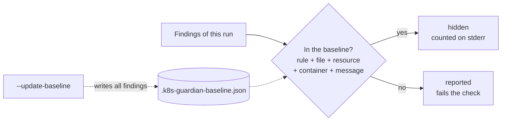

# Configuration

## Config file

k8s-guardian reads `.k8s-guardian.yaml` (or `.k8s-guardian.yml`) from the working directory, or the file passed with `--config`. All keys are optional:

```yaml
# .k8s-guardian.yaml
skip: [KG015, liveness-probe]   # rule IDs or names, in addition to --skip
severity:                       # change a rule's severity
  KG006: error
  KG014: warning
failOn: warning                 # default for --fail-on (the flag wins)
exclude:                        # skipped when walking directories
  - vendor
  - charts/*/tests
rules: [policies/]              # custom rule files or directories
baseline: .k8s-guardian-baseline.json
```

* `check` and `audit` use every key. `diff`, `interactive`, `rules` and `rule create` use `skip`, `severity`, `exclude` and `rules`. `export` uses `rules`.
* Relative paths are relative to the config file.
* `exclude` entries are paths or `filepath.Match` patterns (`*` doesn't cross `/`, and there is no `**`). An excluded directory is skipped with everything below it. Inputs passed explicitly with `-f` are always checked.
* Unknown keys and unknown rules in `severity` are errors, so a typo can't silently turn a setting off.
* The GitHub Action runs in the repository root, so it picks the file up automatically.

## Baseline

A first run on an existing repository often reports hundreds of findings. A baseline records them, so the check only fails on **new** ones while you fix the backlog:

```bash
k8s-guardian check -f k8s/ --update-baseline          # writes .k8s-guardian-baseline.json
git add .k8s-guardian-baseline.json
k8s-guardian check -f k8s/ --baseline .k8s-guardian-baseline.json
```

Or set `baseline:` in the config file, so every `check` (and the GitHub Action) uses it.



* Findings are matched by rule, file, resource, container and message, **not by line number**: moving code up or down keeps a finding known.
* A finding recorded once hides one occurrence, so a second identical problem is still reported.
* Known findings are counted on stderr: `note: 42 known finding(s) hidden by baseline …`.
* Run `--update-baseline` again after fixing findings to shrink the file. The file is sorted, so its diff shows what was fixed.
* `--update-baseline` can't be combined with `--fix`: fix first, then record what is left.

## Environment

| Variable | Used for |
|----------|----------|
| `ANTHROPIC_API_KEY`, `ANTHROPIC_AUTH_TOKEN` | [AI features](ai.md) |
| `K8S_GUARDIAN_MODEL` | Claude model (default `claude-opus-5-5`) |
| `K8S_GUARDIAN_RULES` | Extra custom rule paths, separated like `$PATH` |
| `K8S_GUARDIAN_CPU_HOUR`, `K8S_GUARDIAN_GIB_HOUR` | Prices for [cost](cost.md) |
| `K8S_GUARDIAN_PROMETHEUS_TOKEN` | Bearer token for `cost --prometheus` |
